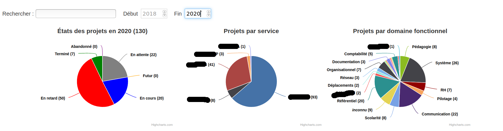
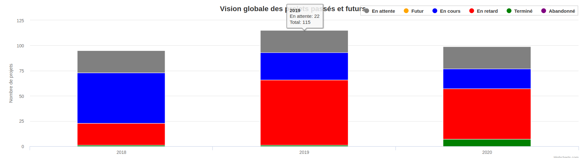
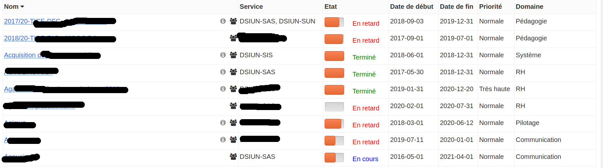

Projets 
==================================================================
Chef de projet : Pascal Rigaux

Techno : Kanboard >= v1.2.4 (validé en 1.2.18)

Liens : https://kanboard.org/

## Installation :

```git clone https://github.com/UnivParis1/kanboard-plugin-indicateurs plugins/Indicateurs```

Ce projet est dérivé du projet https://github.com/UAPV/KB-plugin-CA de Jade Tavernier à l'université d'Avignon

## Présentation

Un lien indicateurs sur l'écran résumé (liste des projets) sur kanban permet d'accès à un écran pour retrouver ces informations :

- 3 graphes camembert (états des projets, projets par service, projets par domaine fonctionnel) ;



- un graphe histogramme vision globale des projets passés et futurs (selon 4 ans d'avant et les 4 ans futurs) ;



- une liste des projets avec leur état (en retard, terminé, en attente, etc) ;



## Règles

Les régles sont les suivantes :

- un projet kanban par application (attention et pas par bureau) avec colonnes de base (en attente, prêt, en cours, terminé) sans piscines (swimlanes) ;

- le projet kanban est attaché à un ou plusieurs services (dans le projet kanban il faut choisir dans les permissions dans les groupes autorisés, un groupe ldap (de service) et choisir le rôle directeur de projet, et choisir le groupe visualiseur de projet pour que les personnes puissent le voir par exemple DSI) ;

- les états des projets sont (selon les dates du projet kanban dans configurer le projet / modifier le projet) :
  - en attente : date de début non renseigné
  - futur : date début > date courant
  - en retard : date de fin < date courant
  - terminée : projet “fermé”
  - abandonné : présence du mot clé “#Abandonné” (à voir comment on s'en sert, Aymar n'a pas su répondre)

- domaine fonctionnel est une catégorie dans le projet kanban avec le prefixe DF_ 
